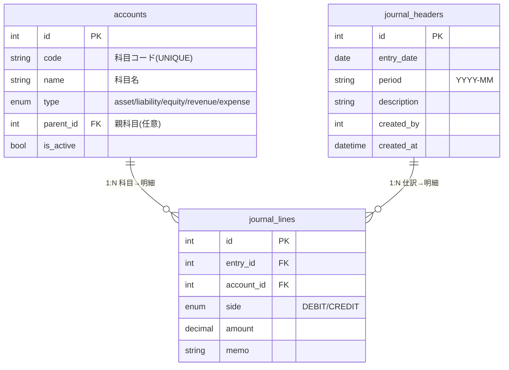

# ER図（MVP）

このドキュメントは、JournAPI の最小構成（MVP）のER図です。

## 構成メモ
- **accounts** … 勘定科目マスタ（type=asset/liability/equity/revenue/expense）
- **journal_headers** … 仕訳ヘッダ（periodは`YYYY-MM`）
- **journal_lines** … 仕訳明細（entry_id・account_idへのFK、sideはDEBIT/CREDIT）