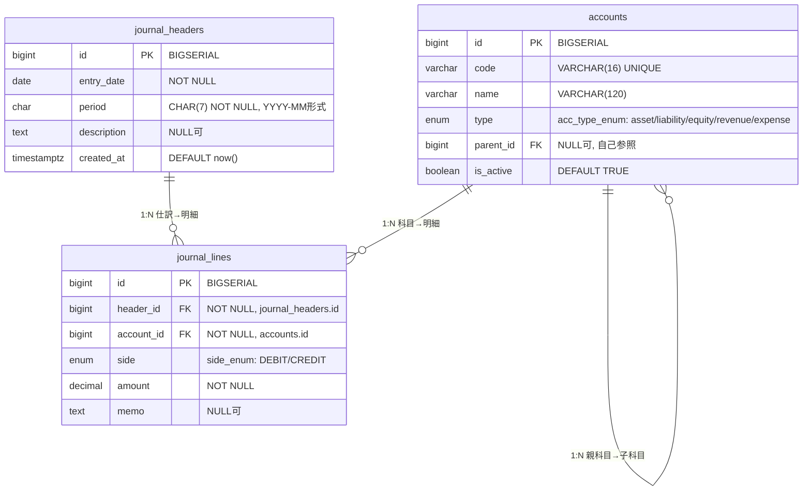

# ER図（MVP）

このドキュメントは、JournAPI の最小構成（MVP）のER図です。

## 概要

### テーブル構成
- **accounts**: 勘定科目マスタ（階層構造対応）
- **journal_headers**: 仕訳ヘッダー（期間管理）
- **journal_lines**: 仕訳明細（複式簿記の借方・貸方）

### 主要な関係
1. **勘定科目階層**: accountsテーブルの自己参照による親子関係
2. **仕訳構造**: journal_headersとjournal_linesの1対多関係
3. **科目参照**: journal_linesからaccountsへの参照

詳細な技術仕様については [database_schema.md](database_schema.md) を参照してください。