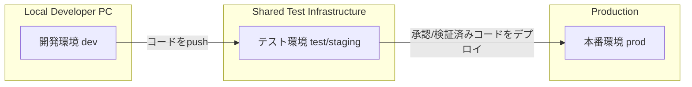

# 環境ごとの利用目的とルール

## 環境構成図



## 環境ごとの目的

### 開発環境 (dev)
- **各開発者のローカルPCで利用**
- 新機能の実装、デバッグ、単体テストを行う
- **ローカルPostgreSQL**を接続先とする（localhost:5432/journapi）
- **開発者向けの便利な設定**：
  - SQLログの表示（show-sql: true）
  - デバッグ用のマイグレーション（dev用マイグレーションを含む）
- **例外的に** テスト環境のDB/APIに接続することがある（疎通確認や本番に近いデータでの検証のため）

### テスト環境 (test / staging)
- **チームで共有する環境**
- CI/CDによって最新のブランチがデプロイされる
- QA/テスターが動作確認を行う
- **H2インメモリデータベース**を使用（CI/CD向け最適化）
- **テスト用の設定**：
  - PostgreSQL互換モードでH2を使用
  - テスト用のマイグレーション（test用マイグレーションを含む）
- 基本的に **この環境にデプロイされたコードでテストを行う**
- ローカルから直接テスト環境リソースに接続する場合は、**一時的なデバッグ目的に限定**

### 本番環境 (prod)
- **実際のユーザーが利用する環境**
- 安定稼働が最重要
- 監視、バックアップ、障害対応の体制を整える
- **環境変数による設定管理**：
  - DB_HOST, DB_PORT, DB_USER, DB_PASS
  - 機密情報の外部化
- **本番用の設定**：
  - 共通マイグレーションのみ使用
  - 環境変数による柔軟な設定
- 直接アクセスやローカルからの接続は禁止

## データベース設定の詳細

### 開発環境 (dev)
```yaml
spring:
  datasource:
    url: jdbc:postgresql://localhost:5432/journapi
    username: devuser
    password: devpass
    driver-class-name: org.postgresql.Driver
  jpa:
    hibernate:
      ddl-auto: validate
    show-sql: true  # 開発用：SQLログ表示
  flyway:
    enabled: true
    baseline-on-migrate: true
    locations: classpath:/db/migration/common,classpath:/db/migration/dev
```

### テスト環境 (test)
```yaml
spring:
  datasource:
    url: jdbc:h2:mem:journapi_test;MODE=PostgreSQL;DATABASE_TO_UPPER=false;DB_CLOSE_DELAY=-1
    driver-class-name: org.h2.Driver
    username: sa
    password:
  jpa:
    hibernate:
      ddl-auto: validate
    properties:
      hibernate:
        dialect: org.hibernate.dialect.PostgreSQLDialect
  flyway:
    enabled: true
    baseline-on-migrate: true
    locations: classpath:db/migration/common,classpath:db/migration/test
```

### 本番環境 (prod)
```yaml
spring:
  datasource:
    url: jdbc:postgresql://${DB_HOST}:${DB_PORT:5432}/journapi
    username: ${DB_USER}
    password: ${DB_PASS}
    driver-class-name: org.postgresql.Driver
  jpa:
    hibernate:
      ddl-auto: validate
  flyway:
    enabled: true
    baseline-on-migrate: true
    locations: classpath:db/migration/common
```

## 環境別の特徴

### 開発環境の特徴
- **ローカルPostgreSQL**を使用
- **SQLログ表示**でデバッグ支援
- **dev用マイグレーション**を含む
- **固定の接続情報**（開発者間で統一）

### テスト環境の特徴
- **H2インメモリDB**で高速テスト
- **PostgreSQL互換モード**で本番に近い動作
- **test用マイグレーション**を含む
- **CI/CD向け最適化**

### 本番環境の特徴
- **環境変数**による設定管理
- **機密情報の外部化**
- **共通マイグレーション**のみ使用
- **柔軟なデプロイ設定**

## ルールまとめ
1. **テスト環境での動作確認は、原則テスト環境にデプロイしたコードで行う**  
2. **ローカルからテスト環境のリソースに接続するのは例外的なデバッグ目的に限る**  
3. **本番環境への直接アクセスは禁止**（必ずデプロイプロセスを経由する）  
4. 環境ごとの設定は `application-<profile>.yml` で明確に分離する  
5. ルールを逸脱する場合はチーム内で事前に共有・合意を取ること
6. **本番環境の機密情報は環境変数で管理し、リポジトリにコミットしない**
7. **開発環境の設定は開発者間で統一し、ローカル開発を容易にする**

---

この文書はプロジェクトルールとして随時更新してください。
